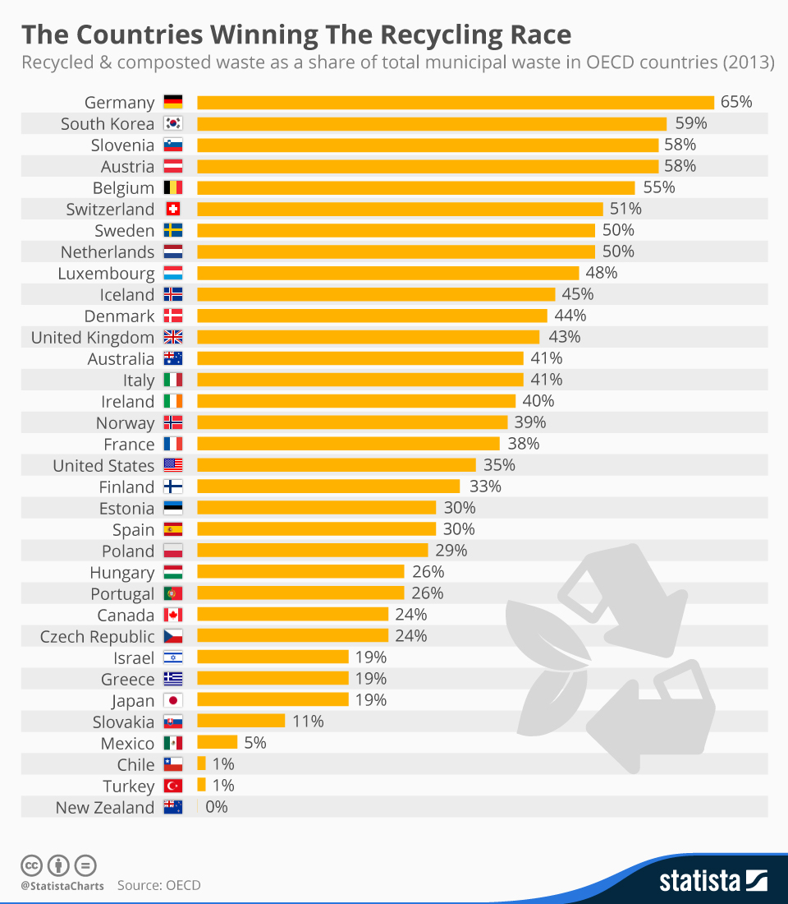
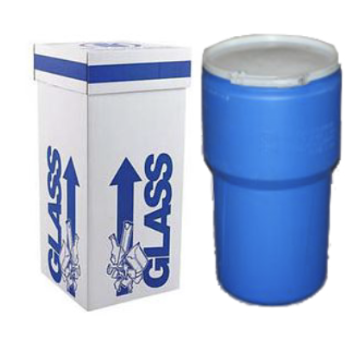
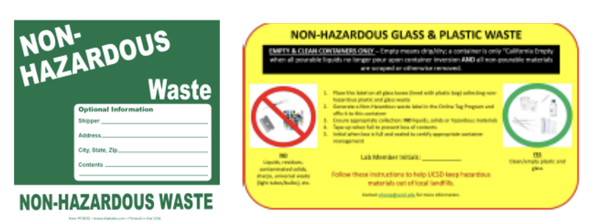

<meta charset="utf-8">

# Erase the E-waste

## Introduction

This is the official website for group "E-waste Invention" from SYN 100 Section M Fall 2023 &#x1F9DC;&#x1F9DC;&#x1F9DC;. In our project, we aim to spread awareness on the mistakes often made when recycling and also create a collection program for Seventh college to make e-waste disposal readily available for on campus students. We wish to spread awareness of improper recycling, especially on campus, by creating a guide (in the form of a website) to help students differentiate what should and shouldn’t be recycled. This website will include information on the dangers of improper recycling and e-waste, why it is important to follow the recycling guide when sorting garbage, and recycling guidances both for recycling certens within UCSD &#x1F9DC; campus and outside public recycling centers.

Alongside the guidance provided in the website, the project will also look into the lack of access for UCSD students regarding e-waste recycling. Interviews will mainly be conducted towards students to better understand the issue of student’s lack of knowledge of e-waste disposal. If anyone interested in the our inteview, please dive further on our [Instgram]() 

[comment]: # (In addition, The main portion of Project “E-Waste Intervention” will be centered on the e-waste collection system we hope to implement in Seventh College dorms. Smaller electronic items, such as batteries and e-cigarettes, are often items that students go through quickly and are difficult to dispose of on UCSD campus. Due to this issue, we hope to deploy numerous collection boxes around Seventh College dorms to serve as an e-waste disposal mechanism accessible to Seventh students. )

## Recycling Fact in US

Did you know that the U.S. has only 35% of recycling rate, which is only half of Germany’s recycling rate?



It is quite shocking, right? &#x1F631; \
Yet, we have various ways to increase our recycling rate of e-wastes on UCSD campus using university facilities!

## Recycling on UCSD Campus &#x1F9DC;

At here, we collected essential all of the recycling information for UCSD students living on campus. If you have any e-waste and don't know how to do with, you are at the right place &#128071;

* &#x1F9EA; Are you doing science/engineering project  that produce lots of e-waste? You can contact UCSD Research Assistance Program (RAP) specialist on your department! They will take care of those wastes. &#x1F449; [click here](https://blink.ucsd.edu/safety/research-lab/laboratory/RAP/contacts.html
)

* &#x1F50B; Disposable battery (one-time use):
   
    * If you have only a few:
    
        1. Cover the terminal parts of battery with electrical tape. 

        2. Put them in bags or containers.

        3. Address the package to "Used Batteries" at Mail Code 0958.

        4. Done! 🎉

    * Else, if you have a bunch of batteries:

        Contact facility member to request for pick-up through [this Email](hazwaste@ucsd.edu). (Include your name, phone number, building, number of batteries, and room number where the batteries are located.)

* &#x1F4F1; Cell Phone:
    * Location of Cell Phone Recycling Bins:
        1. Price Center Bookstore
        2. College Residential Life Office
    
    * Campus Mail System:
        1. Address your package to "Cell Phone" at Mail Code 0958.

* Aerosol cans:\
    You must enjoy the fantastic party with your friend. Well, after relaxing, it's our responsibility to recycle those used stuff.

    1. First, Make sure they are completely empty: no residual would remain inside

    2. Put them in the container like this &#128071;
    
        

    3. Put two labels on the container:
        
        

        * Yellow Glass & Plastic Waste Label - can be downloaded [here](canhttps://blink.ucsd.edu/_files/safety-tab/research/yellow-label.pdf) 

        * Non‐Hazardous Online Tag Program Label: you can buy it online, such as Amazon

    4. Request pickup for non-hazardous wastes to UCSD facility management:

        * Hillcrest Medical Center Facilities Engineering: (619) 543-6454

        * Thornton Hospital Facilities Engineering: (858) 657-6400
    

## Recycling Off-Campus
*Are you living outside campus or did not find your e-waste above? Do not worry! Here are ways to recycle e-wastes off-campus and other materials!*

*  &#x1F50B; Disposable battery (one-time use):

    Public facilities such as libraries accept battery drop-off. Here are several San Diego public libraries where you can drop off your batteries:

    ```
    1. Bonita-Sunnyside Branch Library 4375 Bonita Road Bonita: (619) 475-4642

    2. Borrego Springs: 587 Palm Canyon Drive, Suite 125, Borrego Springs: (760) 767-5761

    3. Campo, 31356 Highway 94 Campo: (619) 478-5945

    4. Casa de Oro Branch Library 9805 Campo Rd., #180 Spring Valley: (619) 463-3236

    5. Descanso Branch Library 9545 River Drive Descanso: (619) 445-5279
    ```

* 	&#x267B; Information about Recycling Centers and Recycling Platforms near San Diego Area: 
    
    In San Diego, there are lots of recycling centers where you can drop off certain recyclable materials either for free or with a charge. Depending on where you live, you can get to the closest recycling center and drop off your e-waste.

    Here's several recycling center recommended to all students who live on campus or near the campus:

    
    1. Miramar Recycling Center 

        `Location:  North of state Route 52 at 5165 Convoy St. in San Diego`

        `Operation Hours: Monday through Saturday from 7 a.m. to 4:30 p.m.`

        `Website: `[Click Here](https://www.sandiego.gov/environmental-services/recycling/centers/miramarrecycle)


        It is a San Diego-located landfill & recycling center, 20 minutes away from the UCSD by car. While they accept various recyclable materials, some are coming with a fee, while others are not. Here are the list.

        Charging Policies for Recycling

        * Recycling without a charge:

            * TVs, computer monitors and computer processing units(CPUs)

            * non-CRV glass bottles and jars (clear, blue, brown and green)

            * non CRV narrow neck plastic containers

            * non-CRV steel cans

            * metals - ferrous (iron) metals like barbecues, wrought iron, etc

            * mixed paper

            * used residential cooking oil - maximum 30 quarts

        * Recycling with fee:

            * refrigerators, freezers, air conditioners and other appliances that contain chlorofluorocarbons (CFCs)

                **Fees: $25.00 each**

            * large household appliances (stoves, washers and dryers, hot water heaters, etc.)

                **Fees (all customers) $12.00 each**

    2. Update Green Electronics Recycling Center 

        `Location: 7887 Dunbrook Rd. Suite C, San Diego, CA, 92126`

       `Hours: Monday through Friday 9am – 4pm, Saturday 10am – 3pm`

       `Website: `[Clikc Here](https://updategreen.com/)


       * Products that can be Dropped Free:
         
         * Computers (PC, Desktop, Laptop, All-in-one, etc.)

         * Computer Parts, Accessories and Peripherals

         * TV and Monitor (Any type & any size)

         * Standard Printer (Limit of 3)

         * Mobile Devices (Camera, Cellphone, Tablet, etc.)

         * Gaming Console and Accessories

         * Wire, Cable, and Adapters (Any type)

* Valuable electronic devices

    Instead of just dumping electronic appliances and devices, you can actually get an economic advantage with retail stores. Common devices for trade-in are computer, smartphone, consoles, video games, tablets, etc.  Here is a list of retail stores that do trade-ins with electronics.

    * **Best Buy:** 
     
        Best Buy will give you a BestBuy gift card as long as the product you brought is worth a value.
        
        You can check the value of your product on [this website](https://www.bestbuy.com/site/services/best-buy-trade-in/pcmcat133600050011.c?id=pcmcat133600050011).

    * **Target:**

        Target will give you gift cards for trade in electronic devices. [Click here](https://help.target.com/help/subcategoryarticle?childcat=Electronics+trade-in+program&parentcat=Product+Support+%26+Services&searchQuery=search+help
        ) for more information.
    
    *  **Amazon:**

         Since Amazon doesn't have offline stores, you can either ship via UPS or drop-off at designated locations. [Click here](https://www.amazon.com/gp/browse.html?node=9187220011&tag=googhydr-20&hvadid=454024616579&hvpos=&hvnetw=g&hvrand=18353986032617850439&hvpone=&hvptwo=&hvqmt=e&hvdev=c&hvdvcmdl=&hvlocint=&hvlocphy=9061180&hvtargid=kwd-12546208191&ref=pd_sl_1ef04654yy_e) for more information.
    
    * **Apple:**

        Apple stores accept Apple watch, iPhones, Mac, iPad, and other Apple devices. [Click here](https://www.apple.com/shop/trade-in) for more information.

    `Since most electronic shops usually accept trade-ins especially related to their selling products, consider doing trade-ins before you throw them away!`


## Why should we recycle?


     
        


    


 


## Reference

* The picture of "erase your ewaste": https://www.willistonchamber.com/calendar#!event/2022/6/8/erase-the-ewaste

* Graph of countries' recycling rate:
https://www.statista.com/chart/4470/the-countries-winning-the-recycling-race/