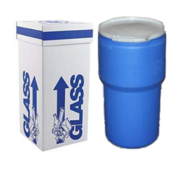
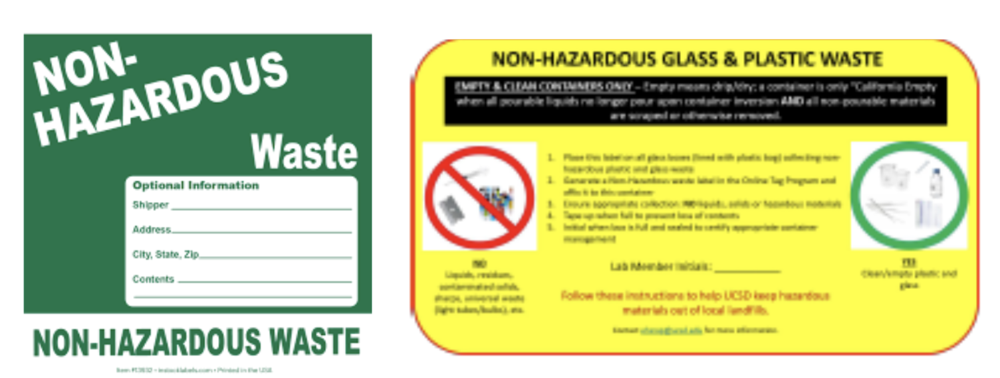
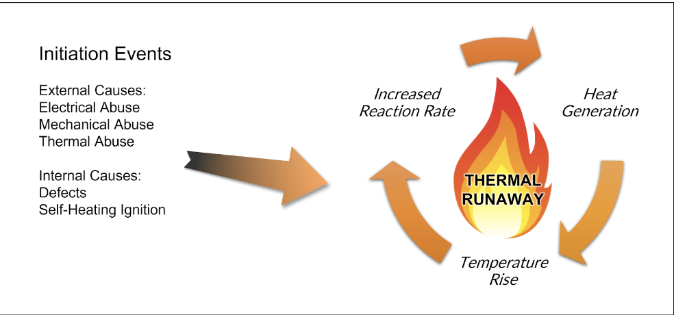
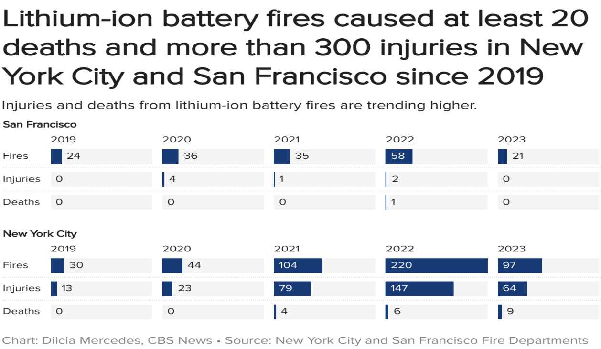
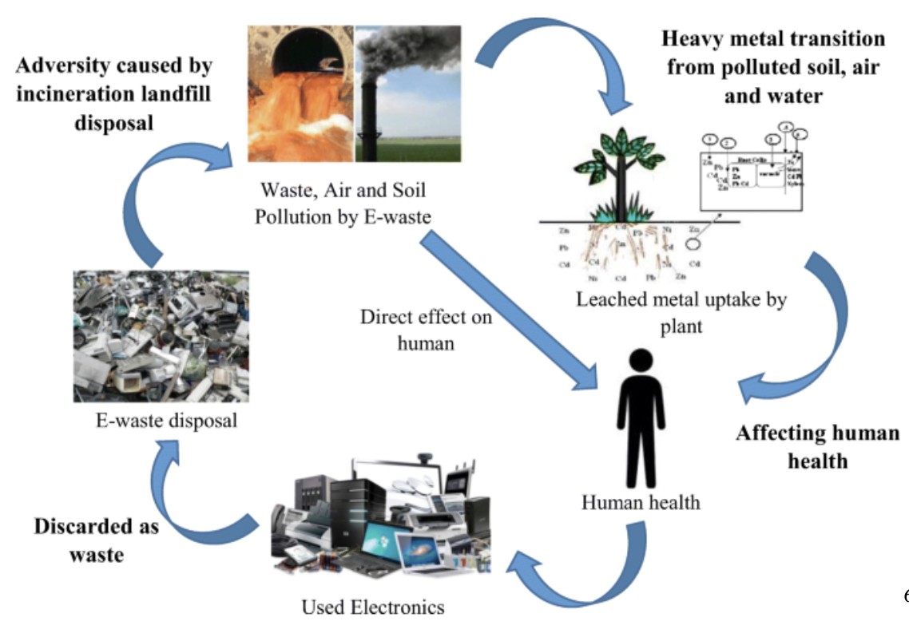
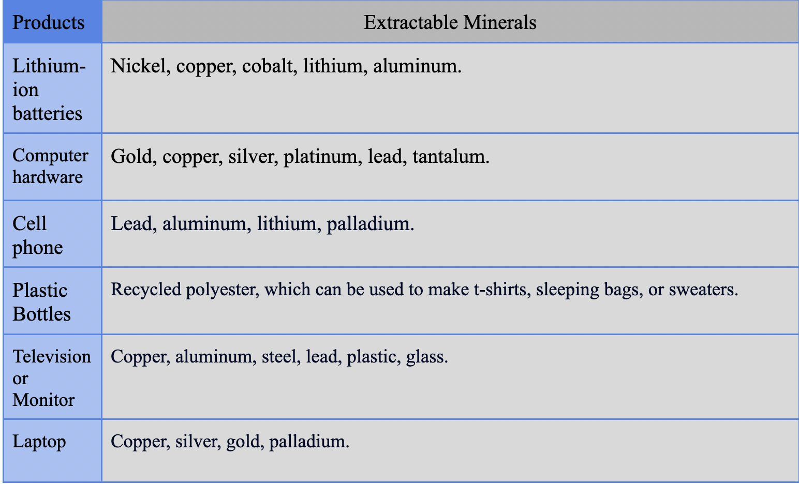
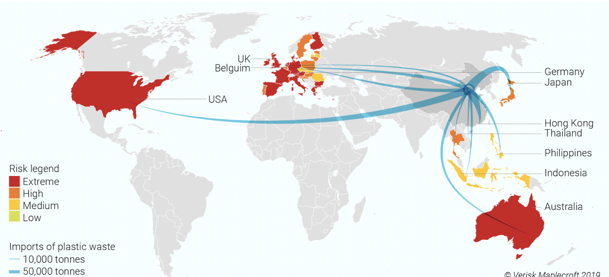

<meta charset="utf-8">

# Erase the E-waste

## Introduction

This is the official website for group "E-waste Invention" from SYN 100 Section M Fall 2023 &#x1F9DC;&#x1F9DC;&#x1F9DC;. In our project, we aim to spread awareness on the mistakes often made when recycling and also create a collection program for Seventh college to make e-waste disposal readily available for on campus students. We wish to spread awareness of improper recycling, especially on campus, by creating a guide (in the form of a website) to help students differentiate what should and shouldn’t be recycled. This website will include information on the dangers of improper recycling and e-waste, why it is important to follow the recycling guide when sorting garbage, and recycling guidances both for recycling certens within UCSD &#x1F9DC; campus and outside public recycling centers.

Alongside the guidance provided in the website, the project will also look into the lack of access for UCSD students regarding e-waste recycling. Interviews will mainly be conducted towards students to better understand the issue of student’s lack of knowledge of e-waste disposal. If anyone interested in the our inteview, please dive further on our [Instgram]() 

[comment]: # (In addition, The main portion of Project “E-Waste Intervention” will be centered on the e-waste collection system we hope to implement in Seventh College dorms. Smaller electronic items, such as batteries and e-cigarettes, are often items that students go through quickly and are difficult to dispose of on UCSD campus. Due to this issue, we hope to deploy numerous collection boxes around Seventh College dorms to serve as an e-waste disposal mechanism accessible to Seventh students. )

## Recycling Fact in US

Did you know that the U.S. has only 35% of recycling rate, which is only half of Germany’s recycling rate?


It is quite shocking, right? &#x1F631; \
Yet, we have various ways to increase our recycling rate of e-wastes on UCSD campus using university facilities!

## Recycling on UCSD Campus &#x1F9DC;

At here, we collected essential all of the recycling information for UCSD students living on campus. If you have any e-waste and don't know how to do with, you are at the right place &#128071;

* &#x1F9EA; Are you doing science/engineering project  that produce lots of e-waste? You can contact UCSD Research Assistance Program (RAP) specialist on your department! They will take care of those wastes. &#x1F449; [click here](https://blink.ucsd.edu/safety/research-lab/laboratory/RAP/contacts.html
)

* &#x1F50B; Disposable battery (one-time use):
   
    * If you have only a few:
    
        1. Cover the terminal parts of battery with electrical tape. 

        2. Put them in bags or containers.

        3. Address the package to "Used Batteries" at Mail Code 0958.

        4. Done! 🎉

    * Else, if you have a bunch of batteries:

        Contact facility member to request for pick-up through [this Email](hazwaste@ucsd.edu). (Include your name, phone number, building, number of batteries, and room number where the batteries are located.)

* &#x1F4F1; Cell Phone:
    * Location of Cell Phone Recycling Bins:

        1. Price Center Bookstore

        2. College Residential Life Office
    
    * Campus Mail System:

        1. Address your package to "Cell Phone" at Mail Code 0958.

* Aerosol cans:

    You must enjoy the fantastic party with your friend. Well, after relaxing, it's our responsibility to recycle those used stuff.

    1. First, Make sure they are completely empty: no residual would remain inside

    2. Put them in the container like this &#128071;
    
        

    3. Put two labels on the container:
        
        

        * Yellow Glass & Plastic Waste Label - can be downloaded [here](canhttps://blink.ucsd.edu/_files/safety-tab/research/yellow-label.pdf) 

        * Non‐Hazardous Online Tag Program Label: you can buy it online, such as Amazon

    4. Request pickup for non-hazardous wastes to UCSD facility management:

        * Hillcrest Medical Center Facilities Engineering: (619) 543-6454

        * Thornton Hospital Facilities Engineering: (858) 657-6400
    

## Recycling Off-Campus
*Are you living outside campus or did not find your e-waste above? Do not worry! Here are ways to recycle e-wastes off-campus and other materials!*

*  &#x1F50B; Disposable battery (one-time use):

    Public facilities such as libraries accept battery drop-off. Here are several San Diego public libraries where you can drop off your batteries:

    ```
    1. Bonita-Sunnyside Branch Library 4375 Bonita Road Bonita: (619) 475-4642

    2. Borrego Springs: 587 Palm Canyon Drive, Suite 125, Borrego Springs: (760) 767-5761

    3. Campo, 31356 Highway 94 Campo: (619) 478-5945

    4. Casa de Oro Branch Library 9805 Campo Rd., #180 Spring Valley: (619) 463-3236

    5. Descanso Branch Library 9545 River Drive Descanso: (619) 445-5279
    ```

* 	&#x267B; Information about Recycling Centers and Recycling Platforms near San Diego Area: 
    
    In San Diego, there are lots of recycling centers where you can drop off certain recyclable materials either for free or with a charge. Depending on where you live, you can get to the closest recycling center and drop off your e-waste.

    Here's several recycling center recommended to all students who live on campus or near the campus:

    
    1. **Miramar Recycling Center** 

         Location:  North of state Route 52 at 5165 Convoy St. in San Diego`

        Operation Hours: Monday through Saturday from 7 a.m. to 4:30 p.m.

        Website: [Click Here](https://www.sandiego.gov/environmental-services/recycling/centers/miramarrecycle)


        It is a San Diego-located landfill & recycling center, 20 minutes away from the UCSD by car. While they accept various recyclable materials, some are coming with a fee, while others are not. Here are the list.

        Charging Policies for Recycling

        * Recycling without a charge:

            * TVs, computer monitors and computer processing units(CPUs)

            * non-CRV glass bottles and jars (clear, blue, brown and green)

            * non CRV narrow neck plastic containers

            * non-CRV steel cans

            * metals - ferrous (iron) metals like barbecues, wrought iron, etc

            * mixed paper

            * used residential cooking oil - maximum 30 quarts

        * Recycling with fee:

            * refrigerators, freezers, air conditioners and other appliances that contain chlorofluorocarbons (CFCs)

                **Fees: $25.00 each**

            * large household appliances (stoves, washers and dryers, hot water heaters, etc.)

                **Fees (all customers) $12.00 each**

    2. **Update Green Electronics Recycling Center**

        Location: 7887 Dunbrook Rd. Suite C, San Diego, CA, 92126

       Hours: Monday through Friday 9am – 4pm, Saturday 10am – 3pm 

       Website: [at here](https://updategreen.com/)


       * Products that can be Dropped Free:
         
         * Computers (PC, Desktop, Laptop, All-in-one, etc.)

         * Computer Parts, Accessories and Peripherals

         * TV and Monitor (Any type & any size)

         * Standard Printer (Limit of 3)

         * Mobile Devices (Camera, Cellphone, Tablet, etc.)

         * Gaming Console and Accessories

         * Wire, Cable, and Adapters (Any type)

* Valuable electronic devices

    Instead of just dumping electronic appliances and devices, you can actually get an economic advantage with retail stores. Common devices for trade-in are computer, smartphone, consoles, video games, tablets, etc.  Here is a list of retail stores that do trade-ins with electronics.

    * **Best Buy:** 
     
        Best Buy will give you a BestBuy gift card as long as the product you brought is worth a value.
        
        You can check the value of your product on [this website](https://www.bestbuy.com/site/services/best-buy-trade-in/pcmcat133600050011.c?id=pcmcat133600050011).

    * **Target:**

        Target will give you gift cards for trade in electronic devices. [Click here](https://help.target.com/help/subcategoryarticle?childcat=Electronics+trade-in+program&parentcat=Product+Support+%26+Services&searchQuery=search+help
        ) for more information.
    
    *  **Amazon:**

         Since Amazon doesn't have offline stores, you can either ship via UPS or drop-off at designated locations. [Click here](https://www.amazon.com/gp/browse.html?node=9187220011&tag=googhydr-20&hvadid=454024616579&hvpos=&hvnetw=g&hvrand=18353986032617850439&hvpone=&hvptwo=&hvqmt=e&hvdev=c&hvdvcmdl=&hvlocint=&hvlocphy=9061180&hvtargid=kwd-12546208191&ref=pd_sl_1ef04654yy_e) for more information.
    
    * **Apple:**

        Apple stores accept Apple watch, iPhones, Mac, iPad, and other Apple devices. [Click here](https://www.apple.com/shop/trade-in) for more information.

    **Since most electronic shops usually accept trade-ins especially related to their selling products, consider doing trade-ins before you throw them away!**


## Why should we recycle?

I guess, lots of people might be wondering, why we care so much about recycling? &#129300; Well, be frankly, though Recycling e-wastes according to strict rules is tiresome when we can just simply throw them away in regular recycling bins, there are deeper reasons why we should endeavor to recycle to make our environment sustainable.

1. &#128293; **<code style="color : Red"> Fire hazard of lithium-ion batteries  </code>**

    Did you know that lithium batteries often cause fire in the landfill, houses, or trash cans when they are not disposed of properly? 

    Actually, any forces that lead to overheating of batteries, such as internal defects or external damage, would initiate chemical reactions inside the batteries, and in extreme cases, it would fire. 

    

    

    What's worse, <code style="color : Gold"> fire extinguisher or water </code> cannot be used to put out battery fires since they are both a metal fire and liquid vapor fire. Only cooling it down would work, which requires a large amount of time. Due to this difficulty of extinguishing, battery fire causes a huge property damage, injuries and deaths when it occurs in cities. 
    
    This is why we need to cover the terminals of batteries with electrical tapes, to prevent catching fire. 

2. &#x2623; **Chemical leakage and soil pollution**

    

    E-wastes have a variety of chemicals inside, which could be harmful to environment. When we dump e-wastes in the landfill trash bins, they will be buried in the ground and those hazardous chemicals will seep into the soil.

   <code style="color : Blue"> What happens once those chemicals enter the soil? </code> &#129300;
    
    First, soil itself will be contaminated. Land will be less productive for farm usage, could cause illnesses who live on that land, and prevent future usage as those permeated chemicals do not get ridden off easily. 

    Next, chemicals would leak into groundwater, and eventually reach out to rivers, lakes, or sea. As the water cycles within the environmental hemisphere, it will render water less edible and liveable, damaging animals, plants, and other organisms that are a crucial part of the ecosystem.

    As a result, we will be more vulnerable to contaminated water, chemical exposure, and seafood that accumulated chemicals throughout the food chain, tasting the consequence of our behavior.

## Benefit of Recycling

1. &#128800; <code style="color : Green"> Saving Raw Resources </code> &#x1F71C;

    First of all, the used products we collected can be decomposed at certain recycling centers and we can extract plenty of raw materials from these recycled products for future production. 

     Below are  a list of raw materials that can be extracted from common e-wastes

    

    As most of the resources we are using right now are irreproducible, it's necessary for us to promote the recycling of used products for the better life of our future generation.

2. &#x1F6E2; <code style="color : Green"> Reducing Emissions & Energy Consumption </code> ☁️

    Recycling materials means less mining for raw materials, extracting virgin materials from various sources which requires lots of petroleum-based energy that emits greenhouse gas. Simply put, recycling reduces the greenhouse effect. 

3. <code style="color : Green">Healthy ecosystem & conserve resourcee </code>

    Mining or extracting oil has the potential to pollute the surrounding environment, such as the sea or forest. If we can reduce the amount of raw materials we need through thorough recycling, we can lessen the burden on our environment and preserve non-reusable resources.

4. <code style="color : Green"> Eco awareness & use less landfills </code>

    Did you know that rich countries export waste to developing countries to preserve their environment while not taking care of other countries’ environment? Those wastes still eat up lands on earth, rendering less areas available for human usage. With recycling, not only we can enhance our eco-awareness and spare lands on the other side of the world. 


    

5. &#128181;  <code style="color : Green"> Saves money & Domestic market & creating jobs </code> 

    There is an economic benefit to recycling. The U.S. imported $249,799 million worth of raw materials in 2021. Yet, the more we raise the U.S. recycling rate, the more we will save money on imports of raw materials. Moreover, raising recycling industry creates a variety of jobs across sections: such as route managers, sorters, drivers, mechanics or technicians for recycling machines, etc. According to US recycling economic information (REI), recycling industry hires 1.25 million people while the US solid waste management industry only employed one-fifth of it as recycling is more labor intensive.


## General Rules on Recycling

While trying to do recycling is valuable itself, we would like to do it properly so that our behavior does not become meaningless. While there are many complex regulations for each item to recycle, we can memorize the most basic rules for commonly disposed items. Here are several rules of thumbs.

* Do not leave remnants of food in the wastes.

* If it’s dirty inside, wash it up before dump it. 

* If you can, minimize the size as much as you can.

* Break down and flatten boxes so that they won’t    take too much space.

* Plastic bags, shredded paper, scrap metal, and medicines are not recyclable.

* Do not bag your recyclables, place them loose in the bin.

* For plastic bottles, containers, and glasses, keep the lid on. 

* Rip off labels from the plastic bottles.

Here are several useful video links that can be referred to before drop-off e-waste:

* Easier ways to recycle: [click here](https://www.youtube.com/watch?v=cKvcAOHeoTs), [click here](https://www.youtube.com/watch?v=TdisqujMsgw)

* Lots of fact about recycling batteries: [click here](https://guides.library.illinois.edu/battery-recycling/facts)

* The disposal methods and potential damage from each kind of battery: [click here](https://www.epa.gov/recycle/used-household-batteries)


## Visualization of Survey

1. From the question "Do you have any gadget, batteries, vapes, or appliances that need to be thrown away?", we can see that the demand for recycling small electronic devices and batteries is pretty high. Half of our survey particiapnts respond with a confirmed answer.

<iframe src="Q1_hist_update.html" width=800 height=600 frameBorder=0></iframe>

2. We following asked the way people deal with their dead batteries and small electronic devices out of use, and we can see that most responsers don't have a habit of properly recycling these stuff. Most of them will either stack them at home or throw these devices into a normal trash bin as regular trash, which can reflect that the recycling education still has a lot work to do.

<iframe src="Q2_hist_update.html" width=800 height=600 frameBorder=0></iframe>

3. The third question asks about UCSD students' opinion on UCSD's recycling services, and from the response we can see that most of the students don't have any clue about these services. To be frank, when we are doing research about on campus service, we found that though there are several kinds of recycling services offered in campus, such as dead batteries collection, most of them are inaccessible to students due to the high recycling fees and complex recycling procedures. Also, the advertisements of these services can be barely found, so it's reasonable to see most students have no idea about the recycling services at UCSD campus.

<iframe src="Q3_hist_update.html" width=800 height=600 frameBorder=0></iframe>

4. The fourth question is similar to the second one, but with object to e-cigarette. The results are similar to the graph in second question, only a small proportion of responsers will explicitly recycle their used e-cigarette at proper locations. 

<iframe src="Q4_hist_update.html" width=800 height=600 frameBorder=0></iframe>